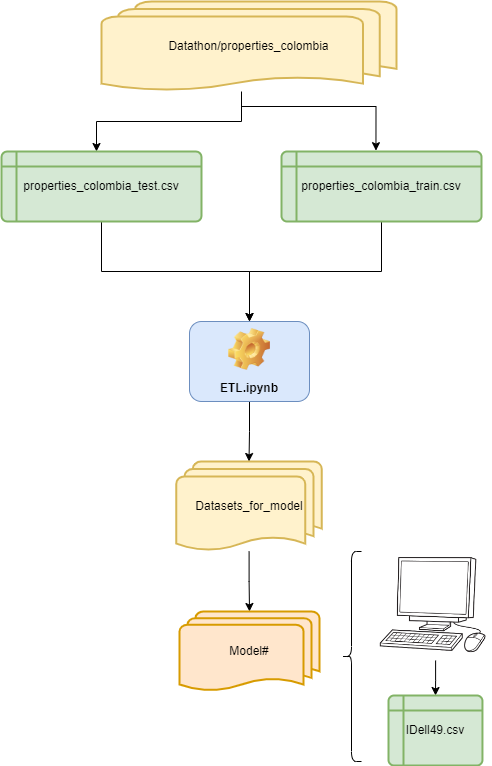

## PI-02-Machine Learning Engineer Datathon:

In this project, our clients wanted us to create a machine learning model designed to predict and classify each different property in their website as expensive(1) or cheap(0). defining expensive as being equal or above the average price for a property.

*remember to unzip the datasets into the './properties_colombia' before running any file*

1) First, we need to look at the data so we can see which features are ready to fit into a model and which aren't. I went column by column trying to know what kind of information they have and if it is relevant to the price (as it is the target feature). You can see my analysis in the ETL.ipynb 

2) When the data is cleaned enough to be usable, we export it into the 'Datasets_for_model' folder as a fresh csv where we can just import it in a new .py/.ipynb file to make tests and exploratory analysis of our newly made model.

    The advantage of having this kind of process is that there can be no kind of trouble between each model's needs when I create new features so they can cleanly just make their own kind of dataset tests without worrying about each other 

3) Make a Model folder for each different model, so it stays documented in a way that's easier to identify progress between the models. then make a Model.ipynb where it's end goal is to make a IDell49.csv(same as my github username) file with one column called pred(which is the target of the model)

4) Lastly I just need to upload that IDell49.csv file into my mentors filing system and it's done! 

